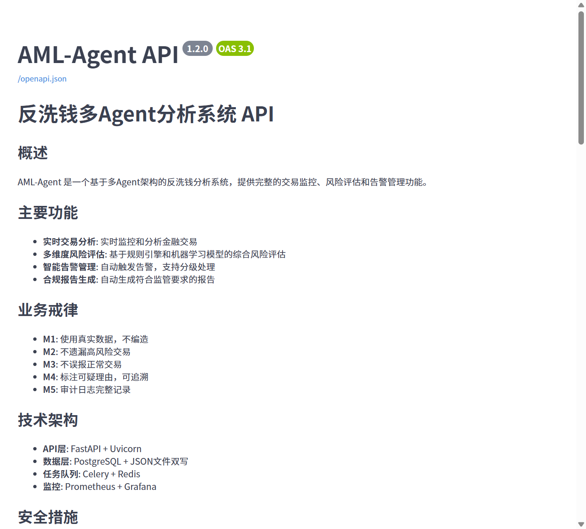

# 反洗钱检测系统

这是一个基于多智能体架构的反洗钱交易检测系统。核心功能包括：规则引擎、图分析、LLM 深度审核、报告自动生成，以及一套完整的参数优化闭环。

[](https://www.python.org/)
[](LICENSE)
[](tests/)
[](tests/)
[](docker-compose.yml)
[](https://fastapi.tiangolo.com/)
[](https://github.com/Weizikai-1/aml-detection-system/actions/workflows/ci-cd.yml)

## 功能预览

| API 文档 | Web 界面 | 报告输出 |
|---|---|---|
|  | *Streamlit 可视化界面* | *PDF/Excel 报告导出* |

## 核心功能

### 规则引擎

系统内置了 10 条反洗钱检测规则：

- **分拆转账**：同一收款人多笔相近金额，规避大额上报
- **快进快出**：资金快速中转，金额相近
- **对敲交易**：资金转出后原路返回
- **大额交易**：单笔超大额
- **基线偏离**：交易行为偏离历史均值（3 倍标准差）
- **备注关键词**：备注含敏感词
- **空壳公司**：多层嵌套股权穿透分析
- **制裁名单**：涉及制裁实体匹配
- **跨境异常**：跨境交易模式异常
- **虚拟货币**：类虚拟货币交易特征（多对一、分散归集）

### 工作流程

系统采用多智能体协作模式，流程如下：

1. 数据预处理 → 2. 规则引擎 → 3. 图分析 → 4. LLM 深度审核 → 5. 报告生成 → 6. 合规审核

每个环节都有明确的职责，通过 LangGraph 编排，支持条件分支（无可疑或全误报时提前结束）。

### 参数优化闭环

系统支持从反馈到优化的完整闭环：

- 反馈质量校验（格式、内容、一致性三层检查）
- 时间衰减权重（误报 90 天 / 漏报 365 天 / 确认 180 天半衰期）
- 多目标参数优化（precision + recall + f1 帕累托前沿）
- A/B 测试框架
- 交叉影响分析（识别参数变更对其他规则的副作用）

## 快速开始

### 环境要求

- Python 3.10+
- DeepSeek API Key（[免费申请](https://platform.deepseek.com/)）

### 安装运行

```bash
git clone https://github.com/Weizikai-1/aml-detection-system.git
cd aml-detection-system
pip install -r requirements.txt
cp .env.example .env
# 编辑 .env，填入 DEEPSEEK_API_KEY
```

启动方式有三种：

**命令行**

```bash
python main.py                    # 使用模拟数据，调用 LLM
python main.py --no-llm           # 离线模式，不走 LLM
python main.py --file your_data.csv  # 分析自己的数据
```

**Web 界面**

```bash
streamlit run app.py
# 打开 http://localhost:8501
```

**API 服务**

```bash
uvicorn api.main:app --reload --port 8000
# 打开 http://localhost:8000/docs 查看接口文档
```

**Docker 部署**

```bash
cp .env.example .env
# 编辑 .env 填入生产配置
docker compose up -d
```

## 测试

项目包含 1298 个测试用例，覆盖规则引擎、反馈管理、参数优化等核心模块。

```bash
python -m pytest                    # 运行全部测试
python -m pytest --cov=./           # 带覆盖率报告
```

## 项目结构

```
aml-detection-system/
├── agents/              # 智能体层（规则引擎、图分析、LLM审核等）
├── api/                 # FastAPI 服务层
├── graph/               # LangGraph 工作流编排
├── tools/               # 工具层（参数优化、反馈管理、A/B测试等）
├── config/              # 配置模块
├── tests/               # 测试（单元、集成、E2E、基准）
├── deploy/              # 部署配置（Docker、Nginx）
├── docs/                # 文档
└── scripts/             # 工具脚本
```

## 业务戒律

系统在代码层面强制保证以下规则：

| 编号 | 规则 | 说明 |
|---|---|---|
| M1 | 真实数据 | 评估基于真实交易和真值集，不编造指标 |
| M2 | 证据完整 | 评分≥60 的可疑交易必须有完整证据链 |
| M3 | 评分范围 | 所有风险评分在 [0, 100] 范围内 |
| M4 | 可追溯 | 全过程原子持久化，索引可查 |
| P1 | 不遗漏 | 漏报多时提高 recall 权重，候选 recall 下降≥30% 拒绝 |
| P2 | 不误报 | 误报多时提高 precision 权重，总命中激增≥200% 警告 |

## 许可证

MIT License

## 免责声明

本项目为技术演示和学习用途，不构成任何金融或法律建议。实际反洗钱合规请遵循当地监管要求并咨询专业人士。